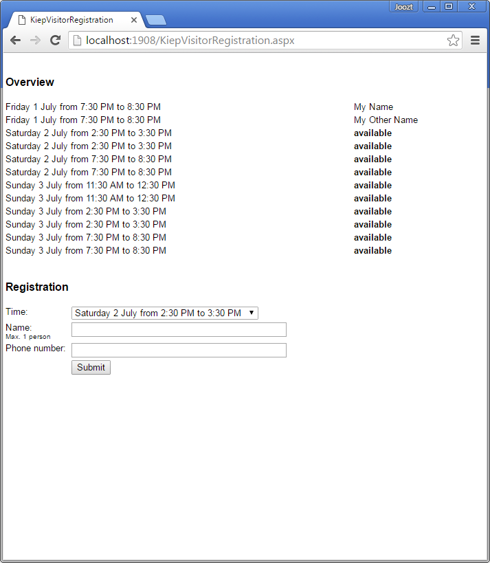
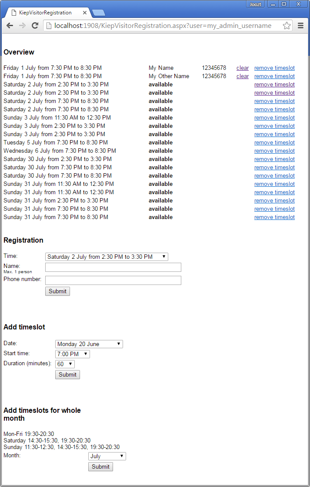
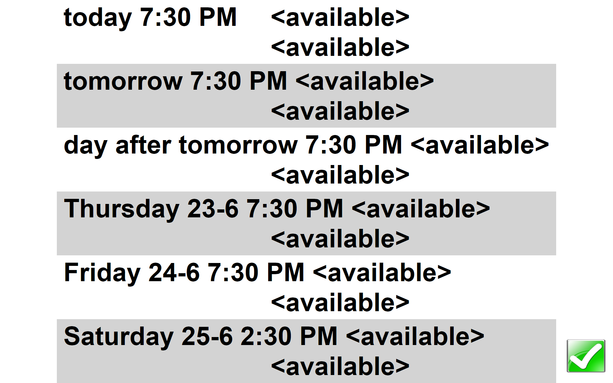

# KiepVisitorRegistration
### A C# WPF application for displaying a fullscreen visitor registration served from ASP.NET

This is a visitor registration system with an ASP.NET & MySQL backend and a fullscreen C# WPF viewer. It is similar to the [KiepAgendaViewer](https://github.com/Joozt/KiepAgendaViewer) project.

Viewer features:
- Single key operation
- Show ASP content fullscreen, auto scaling content to fit
- Cache ASP content for offline use
- Page split with `<page-break>` tag in ASP content
- Divide in blocks with `<new-block>` tag in ASP content
- Next page or exit with mouse click, numpad `+` or numpad `/`

This application uses a [low level keyboard hook](LowLevelKeyboardHook.cs), in order to catch the key presses even if another application (like [Tobii Dynavox Communicator](http://www.tobiidynavox.com/)) is preventing the keys to reach the application.

The C# ASP.NET backend is located [here](KiepVisitorRegistration/). Enter your MySQL database details in [KiepVisitorRegistration.aspx.cs](KiepVisitorRegistration/KiepVisitorRegistration.aspx.cs)

